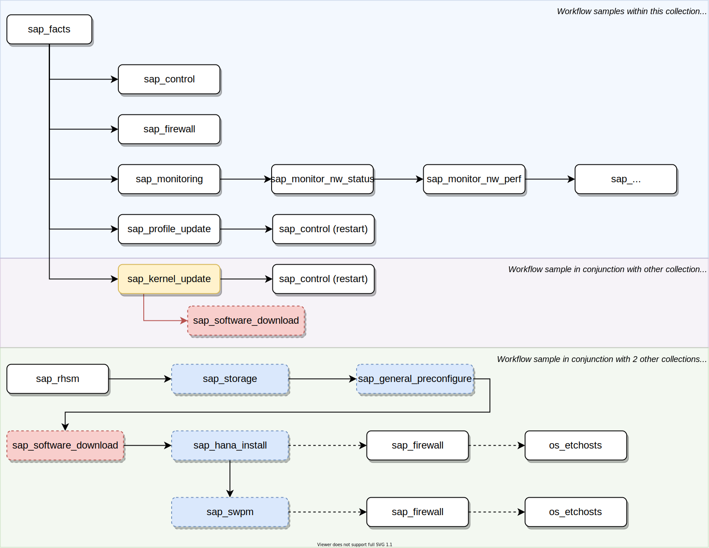

# Execution examples

## Sample execution workflows



## Execution example with Ansible Playbook calling Ansible Module

**Ansible Playbook YAML, execute Ansible Module**
```yaml
---
- hosts: all
  become: true

# Prompt for Ansible Variables
  vars_prompt:
    - name: sap_facts_param
      prompt: "Choose: all, hana, nw"
      private: no

  tasks:
  - name: Execute sap_facts Ansible Module to gather SAP System facts for the host
    community.sap_operations.sap_facts:
        param: "{{ sap_facts_param }}"
    register: sap_facts_register

  - debug:
      msg: "{{ sap_facts_register.sap_facts }}"

  - debug:
      msg: "{{ sap_facts_register.sap_hana_sid }}"

  - debug:
      msg: "{{ sap_facts_register.sap_nw_sid }}"
```

**Execution of Ansible Playbook, with in-line Ansible Inventory of target/remote hosts**

```shell
# Install from local source directory for Ansible 2.11+
ansible-galaxy collection install ./community.sap_operations

# Workaround install from local source directory for Ansible 2.9.x
# mv ./community.sap_operations ~/.ansible/collections/ansible_collections/community

# SSH Connection details
target_private_key_file="$PWD/vs_rsa"
target_host="10.0.50.5"
target_user="root"

# Run Ansible Collection to 1 target/remote host
ansible-playbook --timeout 60 ./community.sap_operations/playbooks/sample-sap-facts.yml \
--connection 'ssh' --user "$target_user" --inventory "$target_host," --private-key "$target_private_key_file"
```


## Execution example with Ansible Playbook calling Ansible Role

**Ansible Playbook YAML, execute Ansible Role on target/remote host**
```yaml
---
- hosts: all
  become: true

# Prompt for Ansible Variables
  vars_prompt:
    - name: sap_sid
      prompt: Please enter target SAP System ID (SID)
      private: no

# Define Ansible Variables
  vars:
    sap_control_function: "restart_sap_nw"

# Option 1: Use roles declaration
  roles:
    - { role: community.sap_operations.sap_control }

# Option 2: Use sequential parse/execution, by using include_role inside Task block
  tasks:
  - name: Execute Ansible Role to start/stop SAP Systems
    include_role:
      name: { role: community.sap_operations.sap_control }

# Option 3: Use task block with import_roles
  tasks:
    - name: Execute Ansible Role to start/stop SAP Systems
      import_roles:
        name: { role: community.sap_operations.sap_control }
```

**Execution of Ansible Playbook, with in-line Ansible Inventory of target/remote hosts with Proxy/Bastion**

```shell
# Install from local source directory for Ansible 2.11+
ansible-galaxy collection install ./community.sap_operations

# Workaround install from local source directory for Ansible 2.9.x
# mv ./community.sap_operations ~/.ansible/collections/ansible_collections/community

# SSH Connection details
bastion_private_key_file="$PWD/bastion_rsa"
bastion_host="169.0.40.4"
bastion_port="50222"
bastion_user="bastionuser"

target_private_key_file="$PWD/vs_rsa"
target_host="10.0.50.5"
target_user="root"

# Run Ansible Collection to target/remote hosts via Proxy/Bastion
ansible-playbook --timeout 60 ./community.sap_operations/playbooks/sample-sap-control-single-restart.yml \
--connection 'ssh' --user "$target_user" --inventory "$target_host," --private-key "$target_private_key_file" \
--ssh-extra-args="-o StrictHostKeyChecking=no -o UserKnownHostsFile=/dev/null -o ProxyCommand='ssh -W %h:%p $bastion_user@$bastion_host -p $bastion_port -i $bastion_private_key_file -o StrictHostKeyChecking=no -o UserKnownHostsFile=/dev/null'"
```

## Execution example with Bash Shell environment

**Execute Bash Functions**
```shell
# Change directory to Ansible Module (in Bash) source
cd ./plugins/modules

# Execute Ansible Module, using Arguments in same way passed from Ansible
echo 'param=all' > vars.sh
bash ./sap_facts.sh 'vars.sh'
rm vars.sh
```
