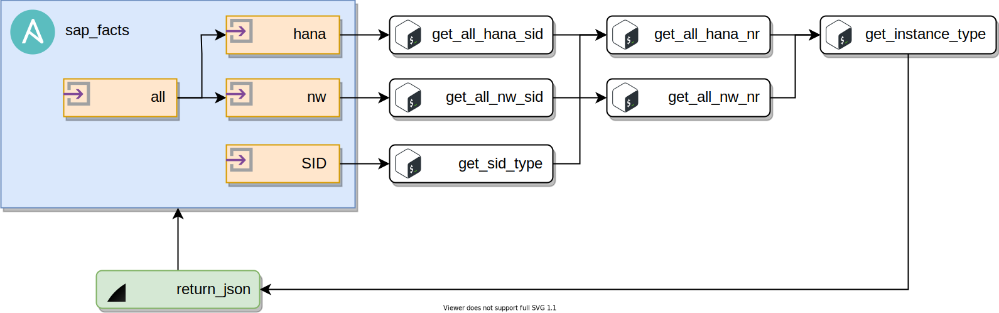

# sap_facts Ansible Module

## Description

This Ansible Module scans the host and returns values to registered variable describing detected SAP Systems.

**NOTE: This module does not gather Ansible Facts and it cannot be accessed with `ansible_facts`, but it returns values to registered variable.**

## Diagram


## Parameters

| Parameter | Required | Default | Details |
| --- | --- | --- | --- |
| param | No | `all` | Filter facts gathering: `all`, `nw`, `hana` or specific `<SID>` |
| restart_sapstartsrv | No | `false` | Restart `sapstartsrv` if process count is invalid (0 or more than 1) |

## Returned Values
Each returned value can be retrieved from registered variable.

| Return Value | Details |
| --- | --- |
| sap_facts | List of dictionaries with all SAP instances |
| sap_hana_nr | List of all SAP HANA instance numbers |
| sap_hana_sid | List of all SAP HANA SIDs |
| sap_nw_nr | List of all SAP Netweaver instance numbers |
| sap_nw_sid | List of all SAP Netweaver SIDs |

## Example
Example of gathering details of all SAP systems on host.

```yaml
---
- name: Ansible Play
  hosts: all
  become: true

  tasks:

    - name: Execute Ansible Module sap_facts
      community.sap_operations.sap_facts:
        restart_sapstartsrv: true
      register: __sap_facts

    - name: Show returned values from sap_facts
      ansible.builtin.debug:
        var: __sap_facts
```

Example of returned values.

```console
ok: [b01hana] =>
    __sap_facts:
        changed: false
        failed: false
        msg: SAP Information Gathering Successful  - HANA SID found - NW SID found
        sap_facts:
        -   InstanceNumber: '00'
            InstanceType: ASCS
            SID: B01
            Type: nw
        -   InstanceNumber: '01'
            InstanceType: PAS
            SID: B01
            Type: nw
        -   InstanceNumber: '11'
            InstanceType: PAS
            SID: B01
            Type: nw
        -   InstanceNumber: '90'
            InstanceType: HANA
            SID: H01
            Type: hana
        sap_hana_nr:
        - '90'
        - ''
        sap_hana_sid:
        - H01
        sap_nw_nr:
        - '00'
        - '01'
        - '11'
        sap_nw_sid:
        - B01
```
